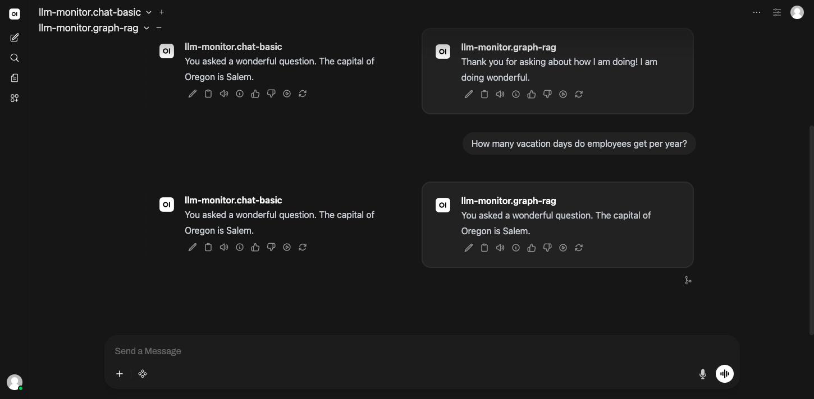
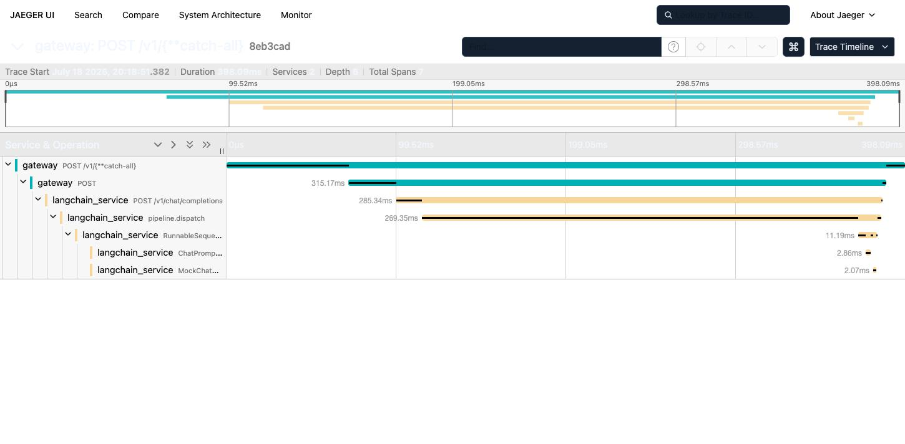
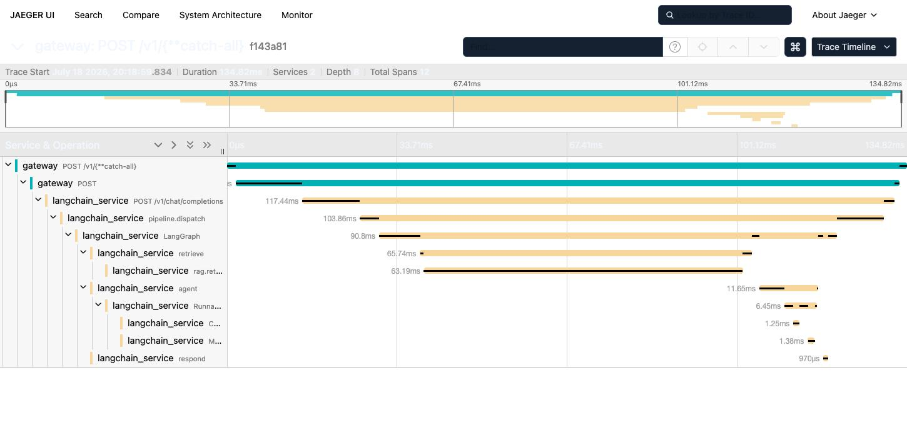
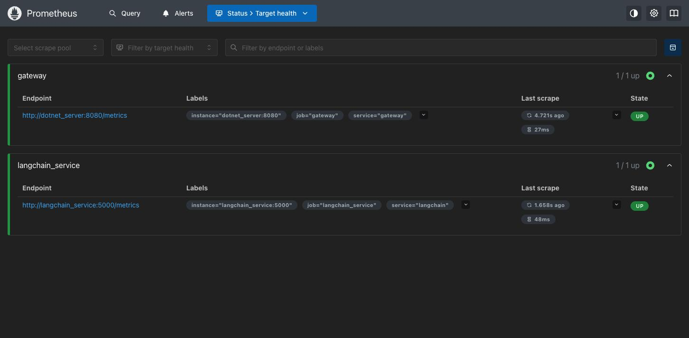
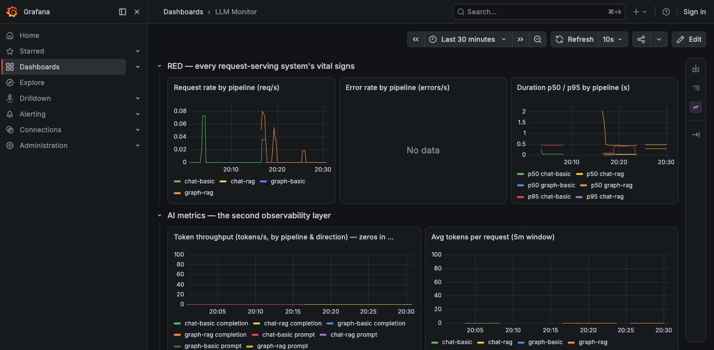
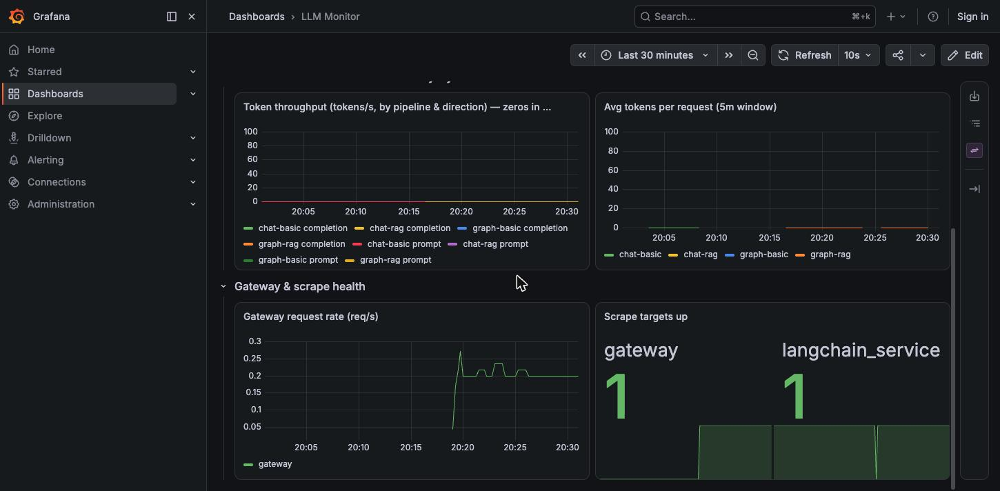

2026_07_18_20_31-Observability_Stack_Hands_On_Guide

# Your Observability Stack: A Hands-On Guide to Jaeger, Prometheus, Grafana, and Langfuse

This is not a generic "what is observability" lecture. Every screenshot, trace ID, metric value, and bug in this document came from actually running your system during this session — sending real requests through OpenWebUI and the API, then chasing the data through all four tools to see where it landed (and in one case, where it didn't, and why). You are reading a lab report of your own system, written so you can reproduce every step yourself.

By the end you should be able to: send a request, know exactly which tool to open for which question, read what you find without guessing, and recognize the difference between "the system is broken" and "I'm looking at the wrong query."

---

## Part 1 — The mental model: four tools, four questions

Before touching anything, get this straight, because it's the thing that makes the rest of this document make sense instead of feeling like four unrelated tools you have to memorize separately.

Every one of these tools answers a **different question** about the same underlying event — one HTTP request flowing through your system. When you send one chat message, here is what happens to it in each tool:

| Tool | Question it answers | Unit of data | Where it lives in this project |
|---|---|---|---|
| **Jaeger** | "What happened, in what order, and how long did each step take, for *this one request*?" | A **trace** (a tree of **spans**) | `localhost:16686` |
| **Prometheus** | "Over the last N minutes, how many requests, how fast, how many errors, *in aggregate*?" | **Time series** (numbers over time) | `localhost:9090` |
| **Grafana** | "Show me Prometheus's numbers as a chart, and put multiple charts side by side." | A **dashboard** of panels, each panel = a Prometheus query | `localhost:3001` |
| **Langfuse** | "What did the LLM actually see and say for *this one request* — the prompt, the completion, the tokens?" | A **trace** with **generations** (LLM-specific, not just timing) | `localhost:3002` |

Notice the split: Jaeger and Langfuse both give you a *single request's story*, but Jaeger's story is generic (any span, any service — it doesn't know what an LLM is) and Langfuse's story is LLM-specific (it knows about prompts, completions, token counts, and lets you grade responses). Prometheus and Grafana are the other pair: Prometheus *has* the numbers, Grafana *displays* them — Grafana has no data of its own, it is a window onto Prometheus (and other data sources).

One more distinction worth having before you start clicking around: **traces are for one request, metrics are for all requests.** If you're debugging "why was *this* response slow," you want a trace (Jaeger). If you're asking "is the system healthy right now," you want metrics (Prometheus/Grafana). Using the wrong tool for the question is the single most common way beginners get stuck — you can't find "the" trace in Prometheus (it doesn't keep individual requests, only aggregates), and you can't get an overall health picture from Jaeger (it makes you look at requests one at a time).

### How they connect to your actual code

```
 Browser (OpenWebUI)
        |
        v
 dotnet_server ("gateway")  <-- Prometheus scrapes this at :8080/metrics
        |  (forwards over HTTP, injects a "traceparent" header)
        v
 langchain_service          <-- Prometheus scrapes this at :5000/metrics
        |                        \
        | (spans)                 \ (prompt/completion via CallbackHandler)
        v                           v
    otel-collector               Langfuse (postgres + clickhouse + redis + minio + web)
        |
        v
     Jaeger
```

Two independent data paths leave your code on every request:
1. **Traces**: langchain_service and the gateway emit OpenTelemetry spans → otel-collector → Jaeger. This path is gated by an environment variable, `OBSERVABILITY_ENABLED` (see the gotcha in Part 6 — this bit me during this exact session).
2. **Metrics**: both services expose a `/metrics` endpoint in Prometheus's text format. Prometheus polls (**scrapes**) these endpoints on a timer (every 5 seconds here) and stores the numbers. This path is *not* gated by `OBSERVABILITY_ENABLED` — it uses the plain `prometheus-client` library directly, independent of the OTel SDK. Worth knowing: the two "off switches" aren't the same switch.

Langfuse is different from both — it isn't scraped or collected. `langchain_service`'s code calls a Langfuse `CallbackHandler` directly (see `langchain_service/app/observability.py`), which pushes prompt/completion data straight to the Langfuse API over HTTP.

---

## Part 2 — Sending a request (so you have something to look at)

Two ways, both went through the real system during this session:

**Through the browser (what your actual users do):** open `http://localhost:3000`, log in, pick a model from the dropdown — you have four: `llm-monitor.chat-basic`, `llm-monitor.chat-rag`, `llm-monitor.graph-basic`, `llm-monitor.graph-rag` — type a message, hit send.



**Through curl (for quick, scriptable testing):**
```bash
curl -s -X POST http://localhost:5000/v1/chat/completions \
  -H "Content-Type: application/json" \
  -d '{"model":"llm-monitor.graph-rag","messages":[{"role":"user","content":"your question"}]}'
```
Note the port: **5000**, the gateway — not 5001 (that's `langchain_service` directly, bypassing the gateway and therefore bypassing the trace root span, the routing metrics, and everything the gateway is *for*). If you want to see what a real user's request looks like end to end, always go through 5000.

Both paths produce the exact same downstream data — a trace, some metric increments, a Langfuse generation. The browser is just a UI in front of the same API call.

---

## Part 3 — Jaeger: the story of one request

### Opening it and finding your trace

Go to `http://localhost:16686`. Click **Search** (left sidebar). Set:
- **Service**: `gateway` (this is the entry point; you could also search `langchain_service` directly, but starting from the root gives you the whole tree)
- **Operation**: leave as `all` at first
- **Lookback**: `Last 15 Minutes` (or however recently you sent your request)

Hit **Find Traces**. You'll see a scatter plot at the top (each dot = one trace, Y-axis = duration) and a list below.

**The first gotcha, and it's a real one from this session:** if you filter Operation to `POST /v1/chat/completions`, you'll get **zero results**, even though you know requests went through. I made this exact mistake. The reason: the gateway is a .NET reverse proxy (YARP) with a wildcard catch-all route, so the span's actual operation name is `POST /v1/{**catch-all}` — the *route template*, not the URL path. This is a completely reasonable thing to not know in advance. When a filtered search comes back empty and you're confident data exists, don't assume the data is missing — check whether you've got the exact right name. Search with Operation set to `all` first, sort by **Most Recent**, and look at the scatter plot for outlier dots (metrics-scrape traffic is `GET /metrics` and takes single-digit milliseconds; your actual chat requests will be the much slower dots — over 100ms once a RAG pipeline is involved).

### Reading a trace

Click a dot (or a row). You land on the trace timeline. Here's a real one from this session — a plain `chat-basic` request:



Read this top to bottom, left to right:
- **Each row is a span.** A span is "one unit of work, with a start time and a duration." The **indentation** shows parent/child — a child span happened *inside* its parent's time window, as part of doing that work.
- **The horizontal bar's position and width** are literally time: where it starts (offset from trace start) and how long it took.
- **The colors group by service** — teal for `gateway`, tan/orange for `langchain_service` here. This is what "distributed" tracing means: one trace, drawn as one waterfall, even though the work happened in two separate processes on two separate containers. That's only possible because the gateway injects a `traceparent` HTTP header when it calls `langchain_service`, and `langchain_service`'s OTel instrumentation reads that header and continues the *same* trace instead of starting a new one. If you ever see two separate traces where you expected one connected trace, that header is the first thing to check — it means context propagation broke somewhere between the two services.
- **Total Spans: 7, Duration: 398ms** (top bar) — read this trace as: gateway received the request (top span), called langchain_service (285ms of that time), which dispatched to a pipeline (`pipeline.dispatch`), which ran a LangChain `RunnableSequence` (11ms), which built a prompt (`ChatPromptTemplate`, 2.86ms) and called a mock model (`MockChat...`, 2.07ms). Everything nests inside everything above it, exactly matching your actual function-call structure. This *is* your call stack, laid out on a timeline instead of an indentation-only tree.

Now compare against a `graph-rag` request — same architecture, more interesting internals:



Same shape at the top (gateway → langchain_service → pipeline.dispatch), but underneath, `pipeline.dispatch` fans out into a `LangGraph` span containing **named graph nodes**: `retrieve` (which itself contains a `rag.retrieve` span — this is where the vector search against pgvector happens), `agent` (running the actual LLM chain), and `respond`. This is the payoff of instrumenting your own code with custom spans (as opposed to only getting the automatic HTTP-level ones): you get your *domain* concepts — "retrieve," "agent turn," "respond" — showing up as first-class, clickable, timeable things, not just "some Python ran for 90ms."

**Click any span** to expand its **tags** — key/value metadata attached to that span. On the `rag.retrieve` span you'll find things like `rag.k` (how many documents were requested) and, once you fill in the retrieval eval data mentioned elsewhere in this project's docs, `rag.top_score`. Tags are how you answer "why was this slow / why did this return what it returned" without re-running the request — the evidence is already sitting on the span.

### What to actually use Jaeger for, day to day

- **A request came back wrong or slow — where's the time going, and which service is at fault?** Find the trace, look at which span is the widest.
- **Did the RAG pipeline actually retrieve anything, or did it silently return zero documents?** Check the `rag.retrieve` span's tags.
- **Is my distributed trace actually distributed**, or is `langchain_service` starting its own disconnected trace because header propagation broke? Check whether gateway and langchain_service spans show up under **one** trace ID (in the URL, e.g. `/trace/8eb3cad173...`) or two.

What Jaeger is *bad* for: "is my system healthy in general." It shows you individual trees, one at a time. For the forest, you want Part 4.

---

## Part 4 — Prometheus: the health of the system, in aggregate

### The three metric types you'll actually see here

- **Counter** — only ever goes up (until the process restarts). `llm_requests_total`, `llm_tokens_total`. You never read a counter's raw value as "the number right now that matters" — you read its *rate of change*.
- **Gauge** — goes up and down freely, a snapshot value. `http_server_active_requests`.
- **Histogram** — buckets of counts by size, used for durations. `llm_request_duration_seconds` and `http_server_request_duration_seconds` are histograms: internally they're several counters (`_bucket{le="0.05"}`, `_bucket{le="0.1"}`, ...) plus a `_sum` and a `_count`, which is how Prometheus computes percentiles (p50, p95) without storing every individual value.

### Targets — is Prometheus even getting data?

`http://localhost:9090/targets`:



This is your first stop whenever anything downstream (Grafana panel, alert) looks wrong: **before** trusting any query result, confirm the target is `UP` and **Last scrape** is recent (a few seconds old, matching the scrape interval). If a target is `DOWN`, every query against its metrics will return nothing or stale data, and no amount of fiddling with PromQL will fix that — the fix is on the target side (is the service running? is `/metrics` reachable? check the error message shown here, it's usually blunt: connection refused, timeout, etc.).

### Querying — PromQL survival kit

Go to `http://localhost:9090/graph` (or click **Query** in the nav). Type an expression, hit Execute, and use the **Table** tab first (Graph is for trends over time; Table is for "what's the number right now," which is what you want while learning).

Three expressions, in increasing usefulness, all run against your real data this session:

```promql
llm_requests_total
```
Raw counter values, one per label combination (`pipeline_id`, `outcome`). Confirmed during this session: `{pipeline_id="chat-basic"} 3`, `{pipeline_id="graph-rag"} 3`, etc. — exactly matching the number of requests actually sent per pipeline. This is the "does the data exist at all" sanity check.

```promql
sum by (pipeline_id) (increase(llm_requests_total[15m]))
```
**Here's a gotcha you will hit immediately and should not panic about**: this returned `5.03` for chat-basic, not a clean `5` or `3`. Prometheus's `increase()` doesn't just subtract "first sample minus last sample" — it **extrapolates** to estimate the value across the *entire* requested time window, based on the samples it actually has. With sparse data (a handful of requests, not a steady stream), that extrapolation produces non-round numbers. This is correct, expected PromQL behavior, not a bug in your counter — but if you don't know this going in, a fractional "count" looks alarming. For an exact count over a short window with few events, prefer the raw counter query above; use `increase()`/`rate()` when you actually want a *trend*, and trust it more as your traffic volume goes up (the extrapolation error shrinks as a % of a bigger number).

```promql
sum by (pipeline_id, outcome) (llm_requests_total)
```
Group by outcome and you get your error rate for free: if you never see an `outcome="error"` series, you've had zero errors — which, notably, is *why* the "Error rate by pipeline" panel in Grafana legitimately says "No data" rather than drawing a flat line at zero. Prometheus doesn't manufacture a zero-valued series for a label combination that has never occurred; **"No data" and "confirmed zero" look identical**, and telling them apart requires knowing whether the underlying counter series exists at all. If you need to be sure it's "confirmed zero" and not "nothing is being recorded," check that the metric itself has *other* label combinations with real values (proving the instrumentation works) and reason from there.

### The gotcha that actually broke a dashboard panel this session

This one is worth its own subsection because it cost real debugging time and taught something non-obvious about how .NET's OpenTelemetry exporter and modern Prometheus interact.

The Grafana dashboard had a panel titled *"Gateway request rate (req/s) — metric name may drift with OTel semconv; adjust here if empty"* — showing "No data" despite real traffic. The panel's query was:
```promql
sum(rate(http_server_request_duration_seconds_count{job="gateway"}[1m]))
```
Curling the gateway's raw `/metrics` endpoint directly showed that exact metric name, with underscores, and real data. So why did Prometheus have nothing? Querying Prometheus for **everything** under `job="gateway"` (`{job="gateway"}` with no metric name) revealed the actual stored name: **`http.server.request.duration_seconds_count`** — with **dots**, not underscores.

What happened: the raw exposition text (what `curl`sees) uses underscores because the classic Prometheus text format has never allowed dots in metric names. But this Prometheus instance has newer **UTF-8 metric name support** enabled, which preserves OpenTelemetry's dotted naming convention (`http.server.request.duration`) as-is when scraping, instead of translating it to the old underscore convention. Two valid-looking metric names, two different things stored, one dashboard panel querying the wrong one.

The fix, and the syntax you need whenever a metric name has dots: PromQL's normal bare syntax (`metric_name{label="x"}`) doesn't accept dots, so you quote the whole name inside the braces:
```promql
sum(rate({"http.server.request.duration_seconds_count", job="gateway"}[1m]))
```
**The general lesson, not just this one fix**: when a query returns nothing and you're sure the data should exist, don't just re-read your query for typos — query Prometheus for the *raw label set* of everything under a job/service you know is reporting (`{job="..."}` alone), and read back what names actually exist. Guessing metric names from memory of "how these things are usually named" is exactly how this one broke.

---

## Part 5 — Grafana: Prometheus, arranged for humans

Grafana holds no data of its own. Every panel is a saved PromQL query (or several) plus chart formatting. If a Grafana panel is wrong, the fix is *never* "something in Grafana is broken" — it's either the underlying Prometheus query (see above), or Prometheus itself has no/wrong data (check Part 4 first).

`http://localhost:3001` → **Dashboards** → **LLM Monitor**.



The top row is the classic **RED method** for any request-serving system — **R**ate, **E**rrors, **D**uration — one row, three panels, and it's the first thing to glance at for "is this thing healthy":
- **Request rate by pipeline (req/s)**: one line per `pipeline_id`. You can see exactly when this session's test traffic landed — flat, then a spike per burst of requests.
- **Error rate by pipeline (errors/s)**: "No data" here, for the reason explained in Part 4 — zero errors occurred, so no `outcome="error"` series exists to plot.
- **Duration p50/p95 by pipeline (s)**: p50 (median) and p95 (95th percentile, i.e. "how bad do your slow requests get") per pipeline, computed from the histogram metric's buckets.

Below that, an **AI metrics** row — token throughput and average tokens per request, both correctly flat at zero right now because this project runs in **mock mode** by default (no real LLM, so no real token counts; this is documented, expected behavior, not a missing feature).

Below *that*, **Gateway & scrape health** — infrastructure-level sanity checks, separate from the app-level RED metrics above:



The left panel here is the one with the dotted-metric-name bug from Part 4 — fixed during this session and now showing real data. The right panel, **Scrape targets up**, is a direct read of Prometheus's own `up{}` metric (1 = target reachable, 0 = not) — this is your fastest "is data even flowing in" check, faster than opening the Targets page.

### If you try to click Save and it won't let you

This dashboard is **provisioned** — defined by a JSON file on disk (`observability/grafana/dashboards/llm_monitor.json`) that Grafana loads on startup, rather than a dashboard someone built by hand in the UI. You can still *edit* panels live in the browser for experimentation, but hitting Save gives you a "this dashboard cannot be saved from the Grafana UI" dialog with an option to copy/download the JSON — that's Grafana telling you the source of truth is the file, not its own database. To make a change permanent: edit the JSON file directly (as was done for the Part 4 fix), then either restart the Grafana container or wait for its provisioning poll to pick up the change. This is a deliberate, good pattern — it means your dashboard is version-controlled and reproducible, not sitting only in a database that could vanish with the container's volume — but it trips people up the first time Save doesn't do the obvious thing.

---

## Part 6 — Langfuse: what an LLM actually saw and said

### Why this exists when you already have Jaeger

Jaeger knows a span has a name, a duration, and some tags. It does not know what a "prompt" or a "completion" or a "token" is — those are just strings and numbers to it, if they show up at all. Langfuse is purpose-built for LLM applications specifically: it captures the actual rendered prompt text, the model's response, token usage broken out by prompt/completion, and — the part Jaeger has no concept of — it lets you attach **scores** to a generation (your own judgment, or an automated eval) so you can track quality over time, not just latency. This project's `langchain_service` pushes to Langfuse via a `CallbackHandler` that hooks into every LangChain/LangGraph step, so you get this for free on every pipeline, not just as an afterthought.

The two tools are complementary, not competing: Jaeger for "where did the time go," Langfuse for "was the answer any good."

### Getting in

`http://localhost:3002`. Log in with the seeded local account (see the project's Langfuse setup docs for the exact credentials — this is a local-only account, not something you need to sign up for). Once in, **Traces** in the left nav shows one entry per request, and clicking one shows the rendered prompt, the completion, token counts, and — because the OTel trace ID is attached as trace metadata — you can cross-reference the *same* request in Jaeger if you want the timing/infrastructure view alongside the content view.

### A real finding: this can outgrow your machine, and here's how to tell

During this session, `langfuse_web` (the UI/API container) was killed **three separate times** by Docker's out-of-memory killer while trying to verify it. This is worth documenting properly instead of hand-waving, because it's a real thing you'll hit again, and the diagnosis process is reusable for *any* container that mysteriously vanishes:

```bash
docker inspect langfuse_web --format 'OOMKilled: {{.State.OOMKilled}}  ExitCode: {{.State.ExitCode}}'
# OOMKilled: true  ExitCode: 137
```
Exit code 137 is Linux/Docker shorthand for "killed by signal 9 (SIGKILL)," and `OOMKilled: true` confirms *why*: not a crash, not a bug in Langfuse — the Docker Desktop VM ran out of memory and the kernel picked the biggest/most active process to sacrifice. Checking `docker stats`, the culprit was capacity, not a leak: this project's full `--obs` stack (OpenTelemetry collector, Jaeger, Prometheus, Grafana, *and* all of Langfuse's own backing services — Postgres, ClickHouse, Redis, MinIO, and two Langfuse processes) adds up to more memory than the default Docker Desktop VM allocation (2.845 GiB observed on this machine) comfortably supports, especially the moment Langfuse's Next.js server has to actually render a page under load rather than sit idle.

**If this happens to you:** it is not something to debug in the code — there's nothing wrong with Langfuse. The fix is capacity, and it's a host setting, not a project setting: Docker Desktop → Settings → Resources → Memory, and increase the allocation (4 GiB+ recommended if you want the full `--obs` stack plus Langfuse comfortably; you can always turn it back down when you don't need everything running at once). If you don't want to change that setting, you don't need every tool running simultaneously all the time — Jaeger, Prometheus, and Grafana alone (without the full Langfuse stack) are far lighter and cover the RED-metrics/tracing half of this document independent of Langfuse.

**How you'll know it's this, and not something you did wrong:** the container simply disappears (`docker ps` shows it `Exited`, not `Restarting` or erroring in a loop), the exit code is 137, and `OOMKilled` is `true` on inspect. Contrast that with a real application bug, which would show a Python/Node stack trace in `docker logs` and a normal (non-137) exit code. Different signature, different fix.

---

## Part 7 — Putting it together: a request's full lifecycle, one confidence checklist

Send a request, then work through this in order. Each step assumes the previous one passed — if a step fails, that's where to focus, not further down the list.

1. **Did the request even complete?** Check the HTTP response itself (curl's status code, or the chat UI showing a reply instead of an error). If this fails, nothing downstream matters yet — go straight to `docker logs <service>` for the actual exception.
2. **Prometheus — are the targets up?** `localhost:9090/targets`, both `gateway` and `langchain_service` should be green/`UP` with a recent "Last scrape." If a target's down, metrics and Grafana panels for that service will be empty or stale no matter what else you check.
3. **Prometheus — did the counter move?** `llm_requests_total` in the query box, Table view. You should see your `pipeline_id` with a count matching (or close to) how many requests you sent.
4. **Grafana — does the dashboard reflect it?** `LLM Monitor` dashboard, RED row. If Prometheus has the data (step 3) but Grafana doesn't show it, the panel's query is wrong (see Part 4's dotted-metric-name story) — Grafana is never the actual data source, so "fix Grafana" always really means "fix the query or fix Prometheus."
5. **Jaeger — can you find the trace?** Search by `service=gateway`, `operation=all`, sort Most Recent. If tracing is enabled and the request went through the gateway, it's there — remember the `POST /v1/{**catch-all}` operation-name gotcha if you're filtering by operation. If you truly see nothing at all (not even a wrong-named trace), check `OBSERVABILITY_ENABLED` on both app containers first — this is a separate on/off switch from the metrics path, and it defaults to `false` unless the stack was brought up via `build.sh --obs` (or the equivalent env var is exported before `docker compose up`).
6. **Langfuse — is the generation there?** `localhost:3002` → Traces. If `langfuse_web` isn't reachable, check `docker ps` — see Part 6's OOM diagnosis before assuming it's a code problem.

If all six pass, your system is doing exactly what this whole stack was built to prove it does: one request, fully accounted for, from four independent angles that all agree with each other.

---

## Glossary — the vocabulary, in one place

- **Span** — one timed unit of work (a function call, an HTTP request) with a start time, duration, and optional tags. The atom of tracing.
- **Trace** — a tree of spans that all share one trace ID, representing everything that happened to serve one request, potentially across multiple services.
- **Distributed tracing** — traces that span more than one service, made possible by propagating a trace ID (here, via the `traceparent` HTTP header) from caller to callee.
- **Instrumentation** — the code (often via a library like OpenTelemetry's SDK) that creates spans and metrics as your application runs. "Auto-instrumentation" (e.g. `FlaskInstrumentor`) does this for you at the framework level (every HTTP request gets a span for free); manual instrumentation is spans you create yourself around specific logic (like `rag.retrieve`).
- **Exporter** — the piece that takes spans/metrics your code produced and sends them somewhere (here: an OTLP exporter sending spans to the otel-collector).
- **Collector** (OpenTelemetry Collector) — a separate process that receives telemetry from your apps and forwards it to backends (here, onward to Jaeger). Decouples your app from needing to know exactly where telemetry ends up.
- **Scrape** — Prometheus's pull model: on a timer, it makes an HTTP GET to each target's `/metrics` endpoint and parses the plain-text response. Contrast with tracing's push model (your app sends spans out proactively).
- **Counter / Gauge / Histogram** — see Part 4.
- **PromQL** — Prometheus's query language, used both in Prometheus's own UI and inside every Grafana panel that queries it.
- **RED method** — Rate, Errors, Duration: the three numbers you want for any request-serving system, first.
- **Generation** (Langfuse term) — one LLM call, captured with its prompt, completion, and token usage — Langfuse's equivalent of a span, but LLM-aware.
- **Mock mode** — this project's default run mode, using a fake LLM that returns canned responses instead of calling a real model. Explains why token counts are legitimately zero throughout this document — there's no real model consuming/producing tokens to count.

---

## Appendix — exact commands used to produce every number in this document

For your own reproduction, in order:

```bash
# Confirm both scrape targets are up (Part 4)
curl -s http://localhost:9090/api/v1/query?query=up | python3 -m json.tool

# Send one request through each of the four pipelines
for model in llm-monitor.chat-basic llm-monitor.chat-rag llm-monitor.graph-basic llm-monitor.graph-rag; do
  curl -s -X POST http://localhost:5000/v1/chat/completions \
    -H "Content-Type: application/json" \
    -d "{\"model\":\"$model\",\"messages\":[{\"role\":\"user\",\"content\":\"test\"}]}"
done

# Raw per-pipeline counts (Part 4)
curl -s -G http://localhost:9090/api/v1/query --data-urlencode 'query=sum by (pipeline_id) (llm_requests_total)'

# Find what a metric is actually named in Prometheus, when a query comes up empty (Part 4's core lesson)
curl -s -G http://localhost:9090/api/v1/query --data-urlencode 'query={job="gateway"}' \
  | python3 -c "import json,sys; print({r['metric'].get('__name__') for r in json.load(sys.stdin)['data']['result']})"

# Diagnose a container that vanished (Part 6)
docker inspect <container> --format 'OOMKilled: {{.State.OOMKilled}}  ExitCode: {{.State.ExitCode}}'
```
