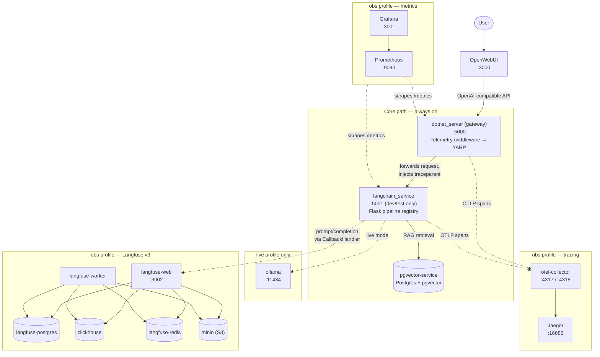

# LLM_Monitor

A self-hosted LLM serving platform: a C# / .NET gateway routes traffic through telemetry middleware and YARP to a Python LangChain/LangGraph service, which runs chat and RAG pipelines against local Ollama models with a pgvector database for retrieval. OpenWebUI sits on top as the chat frontend, talking to the system through an OpenAI-compatible API that I implemented.

I built this to go deep on AI orchestration and to have a real system where I could practice the engineering discipline I want to bring to a production team: contract-first API design, honest CI, health-checked container orchestration, and a documented review process for every change.

# Architecture

Request flow:

OpenWebUI -> dotnet gateway (telemetry middleware -> YARP reverse proxy) -> langchain_service (Flask) -> pipeline registry -> Ollama / pgvector



Solid arrows are the always-on request path; dashed arrows are profile-gated (`live` or `--obs`) and don't exist unless that profile is running.

The services, each in its own container:

- **dotnet_server** — C# gateway. Custom telemetry middleware logs method, path, status, and latency for every request on the way out, then YARP forwards to the inner network. Auth and rate limiting are designed as future middleware in front of the same forwarder.
- **langchain_service** — Python/Flask. Owns a pipeline registry with four pipelines: chat-basic and chat-rag (LangChain chains), graph-basic and graph-rag (LangGraph). Also exposes an OpenAI-compatible surface (/v1/models, /v1/chat/completions) where the model id selects the pipeline, so adding a registry entry automatically exposes a new "model" to any OpenAI client.
- **pgvector-service** — Postgres with the pgvector extension for RAG retrieval. Ingestion is idempotent: documents are hashed and only vectorized once, not re-embedded on every startup.
- **ollama** — local model serving, only started under the live compose profile.
- **openwebui** — chat frontend. Configured to enter through the gateway, so every chat transits the telemetry middleware.

# Running It

```
./build.sh --mode mock        # lightweight, stubbed model provider
./build.sh --mode live        # real hosted model (see "Going live" below for provider setup)
./build.sh --mode mock --obs  # either mode + the observability stack (Jaeger, Prometheus, Grafana, Langfuse)
bash scripts/acceptance_check.sh mock   # PASS/FAIL check against the running system
bash scripts/observability_check.sh     # PASS/FAIL check of the observability stack (requires --obs)
```

The mock mode exists because my development machine can't run heavy models. The entire pipeline (gateway, registry, RAG retrieval, contracts) executes identically in both modes; only the model provider is stubbed.

## Going live

Live mode needs a model provider. Copy `.env.example` to `.env` and pick one:

- **Groq (recommended — free, no card required):** the fastest path to a real model. Set `LLM_PROVIDER=openai_compat` plus the `OPENAI_COMPAT_*` keys (a Groq API key from [console.groq.com](https://console.groq.com)) in `.env`. Embeddings for RAG pipelines run on a local CPU model (`fastembed`) under this provider — no separate embeddings account needed.
- **Azure OpenAI:** set `LLM_PROVIDER=azure` plus the `AZURE_OPENAI_*` keys. Not the default for this project's own live testing right now (see [CLAUDE.md](CLAUDE.md)/the release-plan docs for why), but fully implemented and supported.

Either way: `LLM_PROVIDER` must actually be set in `.env` — there's no implicit default beyond `azure`, so a `.env` with only, say, `OPENAI_COMPAT_*` keys but no `LLM_PROVIDER` line will still try (and fail loudly) to reach Azure.

Startup is health-check ordered (pgvector → langchain_service → gateway → OpenWebUI), so the gateway may be unreachable for the first ~30s. Check readiness with `docker compose -p llm_monitor ps` — `langchain_service` should show `(healthy)`.

# Talking to It

All request/response shapes are defined in [CONTRACTS.md](CONTRACTS.md) — the single source of truth for every HTTP boundary.

## Where everything is

| What | URL | Notes |
|---|---|---|
| OpenWebUI (chat frontend) | http://localhost:3000 | Pick an `llm-monitor.*` model |
| Gateway (real path) | http://localhost:5000 | Telemetry middleware → YARP → langchain_service |
| langchain_service (dev/test path) | http://localhost:5001 | Bypasses the gateway; deleting its port mapping in compose is the production lockdown switch |
| Jaeger (traces) | http://localhost:16686 | `--obs` only |
| Prometheus (metrics) | http://localhost:9090 | `--obs` only |
| Grafana (dashboards) | http://localhost:3001 | `--obs` only; anonymous admin |
| Langfuse (LLM traces) | http://localhost:3002 | `--obs` only; `timothy@localhost.dev` / `local-dev-password-1` |
| Ollama | http://localhost:11434 | `local-live` profile only |
| Voxel world viewer | open `../Tool_Box/viewer/index.html` in a browser | See "Agentic tools & the voxel viewer" below; needs a toolbox image newer than `1.0.1` (or a local build) |

## Sending a message

Through the gateway (the real path — every request here shows up in the telemetry):

```bash
curl -s -X POST localhost:5000/api/llm/graph/rag \
  -H "Content-Type: application/json" \
  -d '{"user_message":"Am I allowed to use scripting tools for automation?"}'
```

Pipelines: `chat/basic`, `chat/rag`, `graph/basic`, `graph/rag` (same request shape for all; see CONTRACTS.md §1–§4) — plus the tool-calling pipelines (`graph/tools`, `graph/premium`, `graph/free`) covered next.

Direct to langchain_service, skipping the gateway (dev/test only):

```bash
curl -s -X POST localhost:5001/graph/rag \
  -H "Content-Type: application/json" \
  -d '{"user_message":"hello"}'
```

Via the OpenAI-compatible surface (what OpenWebUI uses — the model id selects the pipeline):

```bash
curl -s localhost:5000/v1/models
curl -s -X POST localhost:5000/v1/chat/completions \
  -H "Content-Type: application/json" \
  -d '{"model":"llm-monitor.graph-rag","messages":[{"role":"user","content":"hello"}]}'
```

Health check: `curl localhost:5001/healthz` → `{"status": "ok", "mode": "mock"|"live"}`.

## Agentic tools & the voxel viewer

Three pipelines can call real tools via [MCP](https://modelcontextprotocol.io), served by a separate project ([Tool_Box](https://github.com/Timothy-Lee-Grant/Tool_Box)) running as the `toolbox` container: `graph-tools` (lean tier), `graph-premium` (policy gate + RAG + tools), and `graph-free` (same as `graph-tools`, routed to Groq's free tier regardless of `LLM_PROVIDER`). Full tool catalog: [Tool_Box's `docs/TOOL_CATALOG.md`](https://github.com/Timothy-Lee-Grant/Tool_Box/blob/main/docs/TOOL_CATALOG.md) — currently connectivity/identity tools (Basics) and a live-buildable voxel world (Voxel: `place_block`, `place_box`, `place_sphere`, `mirror`, `describe_world`, ...).

Ask in plain language — the model picks the tool calls:

```bash
curl -s -X POST localhost:5001/graph/free -H "Content-Type: application/json" \
  -d '{"user_message":"Build a small 3x3x3 cube of gold blocks at the origin."}'
```

**Watching it happen live:** the Voxel toolset broadcasts every change over a WebSocket (port 8090 on the `toolbox` container) to a static viewer page — a 3D scene, no build step. With the `toolbox` service's `ports: - "8090:8090"` mapping in place (already in `docker-compose.yaml`), open `../Tool_Box/viewer/index.html` directly in a browser (as a local file, or serve it with `python3 -m http.server` from that folder — some browsers block `file://` pages from opening WebSockets). It connects to `ws://127.0.0.1:8090/voxel/`, shows a `● LIVE` status once connected, and renders every block as the agent places it.

Two things worth knowing if this doesn't work out of the box:
- **Image version matters.** The published `ghcr.io/timothy-lee-grant/tool_box:1.0.1` tag predates the fix that lets the viewer's WebSocket work through Docker's port publishing (it originally bound to `127.0.0.1` *inside* the container, which no `ports:` mapping can expose). Until a newer tag ships, point the `toolbox` service at a local build instead: `build: context: ../Tool_Box` in place of the `image:` line.
- **Port 8090 must actually be free on your machine.** The Voxel viewer service starts under *any* transport, including a local `dotnet run`/stdio session (e.g. for Claude Desktop/Code). A leftover local Tool_Box process holding `127.0.0.1:8090` will silently intercept the browser's connection before Docker's port mapping ever sees it — the tools will still work (that part isn't affected), but the viewer will connect and show an empty, frozen world. Check with `lsof -nP -iTCP:8090` if the viewer connects but never updates.

## Viewing telemetry (requires --obs)

The short version — find one request in each pillar:

```bash
docker logs dotnet_server | grep telemetry | tail -1   # structured log line with trace_id
```

Then take that trace_id to Jaeger (http://localhost:16686) for the cross-service trace tree, Prometheus/Grafana for per-pipeline RED + token metrics (query `llm_requests_total`), and Langfuse (http://localhost:3002) for the fully rendered prompt and retrieved chunks.

The full guided tour — one request traced through all four pillars, plus eval commands and troubleshooting — is in [observability/README.md](observability/README.md).

# Observability

With `--obs`, every request leaves a story: a distributed trace across the C# gateway and Python service (one `traceparent` header stitching both into a single Jaeger tree), RED + token metrics per pipeline in Grafana, the fully rendered prompt and retrieved chunks in Langfuse, and gateway log lines carrying the trace id so logs join to traces. A golden-dataset eval harness (hit@k / MRR plus an LLM-as-judge faithfulness score) runs its deterministic tier in CI behind a self-arming regression gate. Everything is profile-gated: without the flag, none of it runs.

**Startup steps and a guided tour of the telemetry (one request traced through all four pillars): [observability/README.md](observability/README.md).**

# Engineering Decisions

**Contract-first API design.** Every HTTP boundary is defined in CONTRACTS.md before it is implemented. Wire shapes are snake_case everywhere, changes must be additive within a version, and both the C# and Python sides implement the shapes exactly. C# maps PascalCase to the wire via JsonNamingPolicy rather than hand-renaming fields.

**Production lockdown is a config change, not a code change.** The langchain_service is directly reachable on port 5001 for development and testing. Deleting that one port mapping in docker-compose is the lockdown switch; the gateway path is the only path that remains.

**Startup ordering through health checks, not sleeps.** The gateway waits on the langchain service being healthy, which waits on postgres being healthy. The langchain healthcheck is stdlib Python because the slim base image ships neither curl nor wget, and its start_period budgets for one-time RAG ingestion.

**Honest CI.** The original GitHub Actions workflow "passed" by installing nothing and running a test that imported no application code. I rebuilt it so the Python job installs the real requirements and runs the real pytest suite, and a separate job builds and tests the C# solution. A green build now means something.

# Testing

- Python: pytest suites covering the API contract, the pipeline registry, the model factory, and idempotent ingestion ids.
- C#: xUnit project for the gateway.
- System level: scripts/acceptance_check.sh runs an end-to-end PASS/FAIL pass against the live containers, deliberately without set -e so every check reports instead of dying on the first failure.

# How This Was Built

This project was developed in two stages, and the process is documented in the repo because I think the process is part of the work.

**Stage 1: hand-written scaffolding.** I built every component myself — the Docker system, the C# gateway, the langchain service — and got the full path working end to end, so that I understood every piece before any AI touched the code.

**Stage 2: AI-collaborative development with review gates.** Larger features go through a staged process (Documentation/AI_Implementation_Plans): I write the design goals, the AI and I discuss architecture and tradeoffs, it produces a step-by-step implementation plan, and then it implements one step at a time with my explicit permission per step. I review every change like a PR — the git history includes rounds of my review feedback and the resulting fixes. Separately, Claude acts as a mentor that writes code reviews and lecture-style documents on concepts it finds I am weak on (Documentation folder).

I did this deliberately: AI-assisted development is how software gets built now, and I wanted to practice doing it with the same rigor as human code review rather than accepting generated code blind.

# Roadmap

- Observability and metrics collection (in progress on the ai_dev branch): structured telemetry beyond the current middleware logging.
- Evals (in progress on the ai_dev branch): retrieval evaluation and LLM-as-judge evaluation against a golden dataset, wired into CI.
- Streaming responses on the OpenAI surface, auth and rate limiting middleware at the gateway, and conversation memory via LangGraph checkpointing (thread_id is already reserved in the contract).

# Milestones

- June 23, 2026 — project start.
- July 2, 2026 — Docker system: build script, compose file, all five services spinning up with environment injection.
- July 8, 2026 — full langchain pipeline connected end to end.
- July 10, 2026 — OpenWebUI talking to my service through the gateway; switched from pure hand development to the staged AI-collaborative process.
- July 11, 2026 — first implementation plan merged (PR #2): pipeline registry, LangGraph pipelines, real YARP proxy, OpenAI-compatible surface, honest CI, idempotent ingestion.
